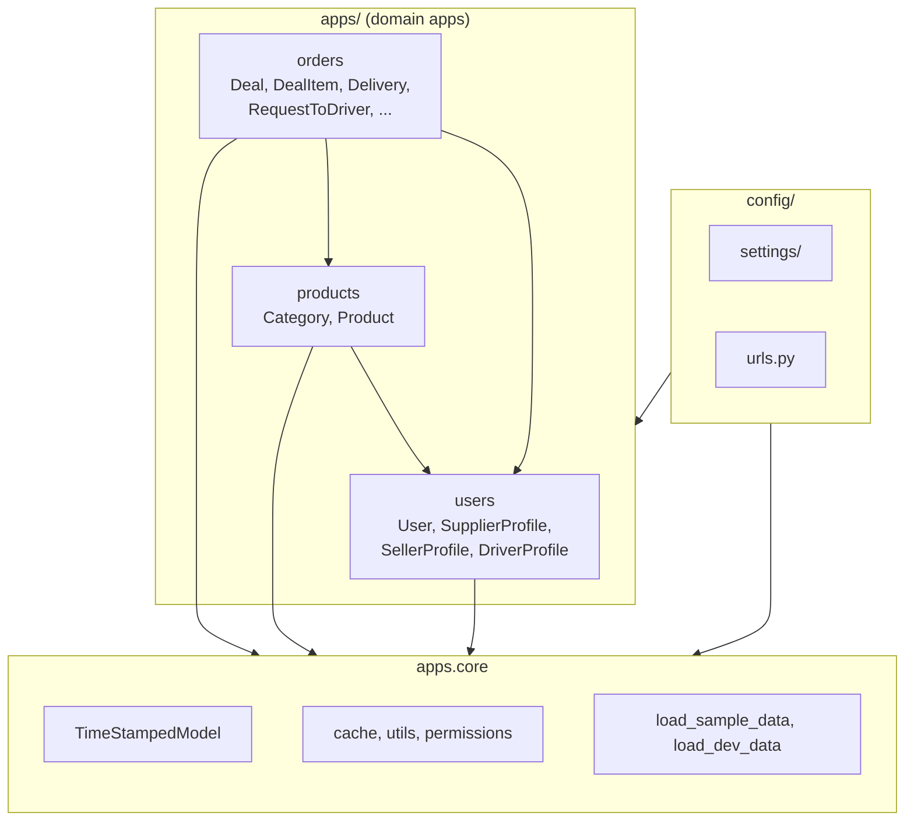

# LogiFood — Project Structure Overview

## 0. Visual Summary (Mermaid)



---

## 1. Top-Level Directory Layout

```
LogiFood/
├── apps/
│   ├── core/                    # Shared base (models, utils, cache, permissions, health)
│   ├── users/                   # User, Supplier/Seller/Driver profiles
│   ├── products/                # Category, Product
│   └── orders/                  # Deal, DealItem, Delivery, DeliveryItem, RequestToDriver
├── config/                      # Django proje config (settings, urls, wsgi)
├── tests/                       # test_core, test_users, test_products, test_orders, test_e2e
├── docker/
├── templates/
├── static/
├── logs/
├── manage.py
├── docker-compose.yml
└── requirements.txt
```

---

## 2. Layer Schema (apps vs src)

```
                    ┌─────────────────────────────────────────┐
                    │              config/                     │
                    │  settings, urls, wsgi, asgi              │
                    └─────────────────┬───────────────────────┘
                                      │
         ┌────────────────────────────┼────────────────────────────┐
         ▼                            ▼                            ▼
┌─────────────────┐    ┌──────────────────────────────────────────────┐
│   apps.core     │    │                   apps/                       │
│                 │    │  users ──► products ──► orders                │
│ • TimeStamped   │◄───│    │           │           │                  │
│   Model         │    │    │           │           │  (domain apps      │
│ • BaseService   │    │    └───────────┴───────────┘   import core)    │
│ • cache,        │    └──────────────────────────────────────────────┘
│   permissions,  │
│   pagination,   │    Dependency: apps.users/products/orders → apps.core
│   utils,        │    Cross-domain: orders → users, products
│   exceptions    │
│ • load_sample_  │
│   data,         │
│   load_dev_data │
└─────────────────┘
```

---

## 3. Module Details

### apps.core
| Dosya | Rol |
|-------|-----|
| models.py | TimeStampedModel (created_at, updated_at, created_by) |
| services.py | BaseService |
| cache.py | cache_get_or_set, cache_key, invalidate_model_cache |
| permissions.py | IsSupplier, IsSeller, IsDriver |
| pagination.py | StandardResultsSetPagination |
| exceptions.py | BusinessLogicError |
| utils.py | success_response, error_response |
| serializers.py | EmptySerializer vb. |
| urls.py | /api/health/ |
| views.py | (health fonksiyonu urls’te inline) |
| filters.py | Ortak filtreler |
| management/commands/ | load_sample_data, load_dev_data |

### apps.users (app label: `users`, AUTH_USER_MODEL = 'users.User')
| Dosya | Rol |
|-------|-----|
| models.py | User, SupplierProfile, SellerProfile, DriverProfile |
| serializers.py | UserSerializer, *ProfileSerializer, Registration |
| services.py | UserService |
| views.py | Register, Login, Profile, ChangePassword, ToggleAvailability |
| urls.py | api/auth/register|login|profile|... |
| utils.py | JWT helpers vb. |
| admin.py | Profil admin’leri |

### apps.products (app label: `products`)
| Dosya | Rol |
|-------|-----|
| models.py | Category, Product |
| serializers.py | CategorySerializer, ProductSerializer, ProductCreateSerializer |
| services.py | CategoryService, ProductService |
| views.py | CategoryViewSet, ProductListView/DetailView, SupplierProductViewSet |
| urls.py | api/products/categories, my-products, products/, products/<pk>/ |
| signals.py | Cache invalidation (invalidate_model_cache) |
| admin.py | CategoryAdmin, ProductAdmin |
| management/commands/ | load_categories |

### apps.orders (app label: `orders`)
| Dosya | Rol |
|-------|-----|
| models.py | Deal, DealItem, RequestToDriver, Delivery, DeliveryItem |
| serializers.py | Deal*, Delivery*, RequestToDriver* |
| services.py | DealService, DeliveryService, RequestToDriverService, DiscoveryService |
| views.py | DealViewSet, DeliveryViewSet, RequestToDriverViewSet, SupplierListView, DriverListView, … |
| urls.py | api/orders/deals, driver-requests, deliveries, suppliers/, drivers/, available-deliveries/ |
| admin.py | Deal, DealItem, Delivery, DeliveryItem, RequestToDriver admin |

---

## 4. API URL Tree

```
/api/
├── auth/                    (apps.users)
│   ├── register/
│   ├── login/
│   ├── logout/
│   ├── profile/
│   ├── profile/role/
│   ├── change-password/
│   └── toggle-availability/
├── products/                (apps.products)
│   ├── categories/          (ViewSet)
│   ├── my-products/        (ViewSet, supplier’s products)
│   ├── items/               (product list/detail)
│   └── items/<id>/
├── orders/                  (apps.orders)
│   ├── deals/               (ViewSet)
│   ├── driver-requests/    (ViewSet)
│   ├── deliveries/          (ViewSet)
│   ├── suppliers/
│   ├── drivers/
│   ├── available-deliveries/
│   └── accept-delivery/<pk>/
├── health/                  (apps.core)
├── schema/                  (drf-spectacular)
├── docs/                    (Swagger)
└── redoc/                   (ReDoc)
```

---

## 5. Model Dependencies (Overview)

```
TimeStampedModel (apps.core)
    │
    ├── User (apps.users) ─── SupplierProfile, SellerProfile, DriverProfile
    │
    ├── Category, Product (apps.products)
    │       Product ──► SupplierProfile, Category
    │
    └── Deal, DealItem, RequestToDriver, Delivery, DeliveryItem (apps.orders)
            Deal ──► SellerProfile, SupplierProfile, users.DriverProfile, delivery_count, delivery_handler
            DealItem ──► Deal, Product
            RequestToDriver ──► Deal, DriverProfile
            Delivery ──► Deal, DriverProfile (opsiyonel)
            DeliveryItem ──► Delivery, Product
```

---

## 6. Notable Inconsistencies / Decisions

### 6.1 Single root: `apps` vs `src`
- **Current:** Single root `apps/`: core, users, products, orders.
- **Note:** Using one root keeps the layout consistent.

### 6.2 Products URL
- **Current:** Product list/detail at `api/products/items/`, `api/products/items/<id>/`.

### 6.3 Management commands
- **Current:** `load_categories`, `load_sample_data`, `load_dev_data` live in apps.core.

### 6.4 Cache (products only)
- **Current:** `apps.core.cache` is used only in `apps.products` (services, views, signals).
- **Note:** No cache in orders/users; add if needed (e.g. discovery/supplier lists).

### 6.5 Signals (products only)
- **Current:** `signals.py` exists only in apps.products (cache invalidation).
- **Note:** No signals for deal/delivery/request lifecycle in orders; add if domain events or audit logging are introduced.

### 6.6 Core’da “view” dağınık
- **Current:** `health_check` is defined inline in `apps.core.urls`; a separate `views.py` exists but health is not there.
- **Note:** For consistency, health can be moved to `views.py` and imported in urls.

### 6.7 Discovery endpoints
- **Current:** `suppliers/`, `drivers/`, `available-deliveries/` live under apps.orders.
- **Gariplik:** Bunlar kullanıcı “keşif” (discovery) endpoint’leri; konsept olarak users veya ayrı bir “discovery” modülüne de taşınabilir. Şu anki haliyle iş mantığı orders (deal/driver/delivery) ile sıkı bağlı olduğu için orders’ta kalmak da mantıklı; sadece ileride büyürse ayrıştırma düşünülebilir.

### 6.8 Test directory naming
- **Current:** `test_orders`, `test_products`, `test_users`, `test_core`, `test_e2e`.
- **Note:** Aligned with module names.

### 6.9 User admin
- **Current:** users admin registers SupplierProfile, SellerProfile, DriverProfile; User has its own UserAdmin.
- **Note:** User is AUTH_USER_MODEL; a simple UserAdmin improves discoverability.

---

## 7. Summary Table

| Topic | Current | Optional improvement |
|-------|---------|----------------------|
| Kök paket | apps + src | Tek kök (src) veya net “core vs domain” ayrımı dokümante et |
| Products URL | .../products/items/ | — |
| Management commands | categories, sample, dev in core | — |
| Cache | Sadece products | Orders’ta ihtiyaç varsa ekle; yoksa “sadece products” notunu yaz |
| Health view | Inline in urls | Move to views.py |
| User admin | Present | — |

This document supports quick review of project structure and design choices.
